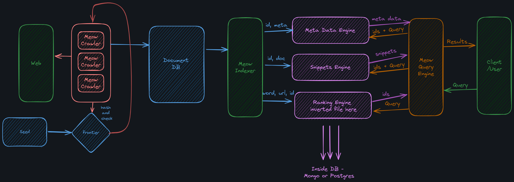
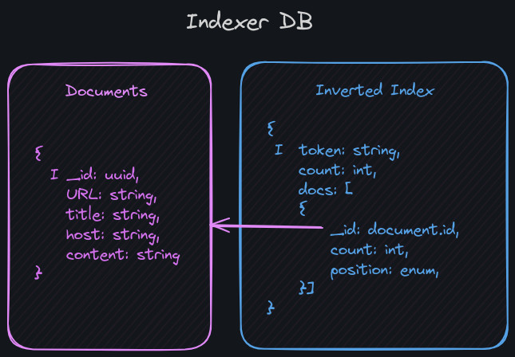
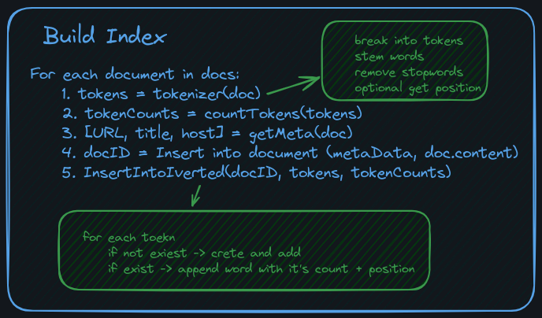

<h1 align="center">
    
     
</h1>

<h1 align="center">
    🐈 Mister Meow 🐈
</h1>

## 📹 Demo

https://github.com/amir-kedis/Mister-Meow/assets/88613195/fb2a0634-326d-41d2-bda4-1d5d5c815f54

---

## 📈 Performance

> [!IMPORTANT]
>
> 1. 🕷 Crawler: **1000** pages in **1m12s** with 64 threads
> 2. 📓 Indexer: **1000** pages in **47s** with 50 threads
> 3. 🔎 Search: search is not stable enough but in general it could be improved in the ranker.

## Draft System Design

### Basic System component

### Indexer DB Design

### Build Inverte Index Algorithem

## Contributions

Please check the following documents before contributing:

- [Git flow](/docs/conventions/git-flow.md)
- [Java setup](/docs/conventions/java-env.md)
- [monogo setup](/docs/conventions/mongo.md)
